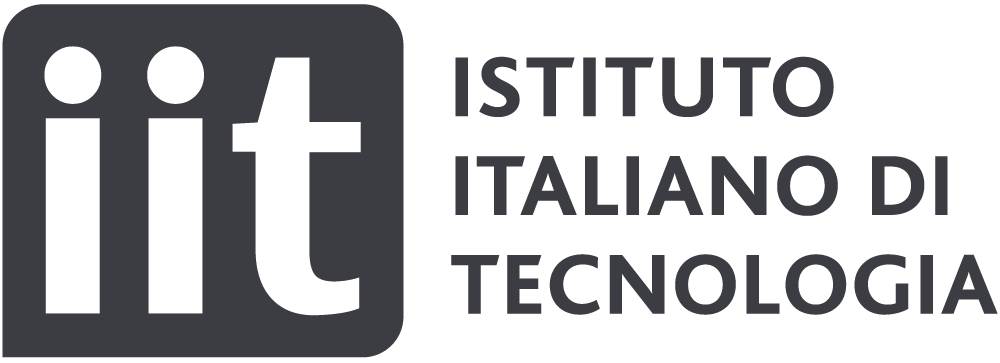

## Welcome to ESNECO project 

ESNECO is a project funded by Marie Skłodowska-Curie Actions, H2020-MSCA-IF-2019 call. Host institution: Istituto Italiano di Tecnologia (IIT), [Neural Coding Laboratory](https://www.iit.it/research/lines/neural-coding).

      

